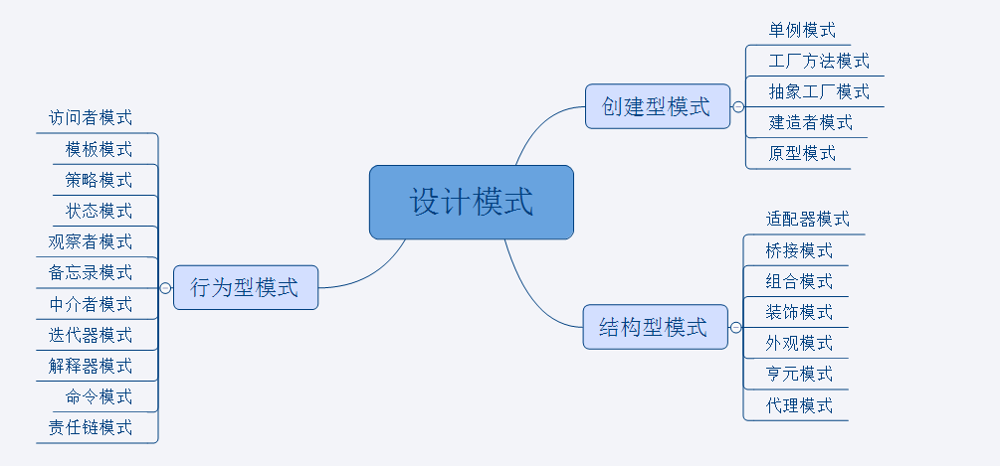

# introduction
设计模式：可复用面向对象软件的基础
关键词：可复用   面向对象
软件设计的金科玉律：复用
解决复杂性：分解+抽象

# 面向对象设计原则
## 1、依赖倒置原则（DIP）
    ·高层模块（稳定）不应该依赖于底层模块（变化），二者都应该依赖于抽象（稳定）。
    ·抽象（稳定）不应该依赖于实现细节（变化），实现细节应该依赖于抽象（稳定）。
## 2、开放封闭原则（OCP）
    ·对扩展开放，对修改关闭
    ·类模块应该是可扩展的，但是不可修改的
## 3、单一职责原则（SRP）
    ·一个类应该仅有一个引起它变化的原因
    ·变化的方向隐含着类的职责
## 4、LisKov替换原则（LSP）
    ·子类必须能够替换它们的基类（IS-A）
    ·继承表达类型抽象
## 5、接口隔离原则（ISP）
    ·不应该强迫客户程序依赖他们不用的方法
    ·接口应该小而完备
## 6、优先使用对象组合，而不是类继承
    ·类继承通常为“白箱复用”，对象组合通常为“黑箱复用”
    ·继承在某种程度上破坏了封装性，子类父类耦合度高
    ·而对象组合则只要求被组合的对象具有良好定义的接口，耦合度低
## 7、封装变化点
    ·使用封装来创建对象之间的分界层，让设计者可以在分界层的一侧进行修改，而不会对另一侧产生不良的影响，从而实现层次间的松耦合
## 8、针对接口编程，而不是针对实现编程
    ·不将变量类型声明为某个特定的具体类，而是声明为某个接口
    ·客户程序无需获知对象的具体类型，只需要知道对象所具有的接口
    ·减少系统中各部分的依赖关系，从而实现“高内聚、松耦合”的类型设计方案

产业强盛的标志：<font color=red>接口标准化！</font>

# 设计模式的三个分类
创建型模式：对象实例化的模式，创建型模式用于解耦对象的实例化过程。

结构型模式：把类或对象结合在一起形成一个更大的结构。

行为型模式：类和对象如何交互，及划分责任和算法。




# 各分类中模式的关键点
单例模式：某个类只能有一个实例，提供一个全局的访问点。

简单工厂：一个工厂类根据传入的参量决定创建出那一种产品类的实例。

工厂方法：定义一个创建对象的接口，让子类决定实例化那个类。

抽象工厂：创建相关或依赖对象的家族，而无需明确指定具体类。

建造者模式：封装一个复杂对象的构建过程，并可以按步骤构造。

原型模式：通过复制现有的实例来创建新的实例。

适配器模式：将一个类的方法接口转换成客户希望的另外一个接口。

组合模式：将对象组合成树形结构以表示“”部分-整体“”的层次结构。

装饰模式：动态的给对象添加新的功能。

代理模式：为其他对象提供一个代理以便控制这个对象的访问。

亨元（蝇量）模式：通过共享技术来有效的支持大量细粒度的对象。

外观模式：对外提供一个统一的方法，来访问子系统中的一群接口。

桥接模式：将抽象部分和它的实现部分分离，使它们都可以独立的变化。

模板模式：定义一个算法结构，而将一些步骤延迟到子类实现。

解释器模式：给定一个语言，定义它的文法的一种表示，并定义一个解释器。

策略模式：定义一系列算法，把他们封装起来，并且使它们可以相互替换。

状态模式：允许一个对象在其对象内部状态改变时改变它的行为。

观察者模式：对象间的一对多的依赖关系。

备忘录模式：在不破坏封装的前提下，保持对象的内部状态。

中介者模式：用一个中介对象来封装一系列的对象交互。

命令模式：将命令请求封装为一个对象，使得可以用不同的请求来进行参数化。

访问者模式：在不改变数据结构的前提下，增加作用于一组对象元素的新功能。

责任链模式：将请求的发送者和接收者解耦，使的多个对象都有处理这个请求的机会。

迭代器模式：一种遍历访问聚合对象中各个元素的方法，不暴露该对象的内部结构。


# 重构获得模式 Refactoring to patterns
    ·面向对象设计模式是“好的面向对象设计模式”，所谓“好的面向对象设计模式”指的是那些可以满足“应对变化，提高复用”的设计
    ·现代软件设计的特征是“需求的频繁变化”。设计模式的要点是“寻找变化点，然后在变化点处应用设计模式，从而来更好低应对需求的变化”。“什么时候、什么地点应用设计模式”比“理解设计模式结构本身”更为重要
    ·设计模式的应用不宜先入为主，一上来就使用设计模式是对设计模式的最大误用。没有一步到位的设计模式。敏捷软件实践开发提倡的“Refactoring to patterns”是目前普遍公认的最好的使用设计模式的方法

# 重构关键技法
    ·静态 -> 动态
    ·早绑定 -> 晚绑定
    ·继承 -> 组合
    ·编译时依赖 -> 运行时依赖
    ·紧耦合 -> 松耦合

# 从封装变化角度对模式分类
# 1、组件协作
现代软件专业分工之后的第一个结果是“框架与应用程序的划分”，“组件协作”模式通过晚期绑定，来实现框架与应用程序之间的松耦合，是二者之间协作时常用的模式
## Template Method 模板设计模式
    父类有函数step1()~step5()，run()函数按顺序调用1~5
    现在将函数step2()和step4()声明为虚函数，支持变化，给子类重写（稳定中有变化）
    ---稳定（step1()、step3()和step5()）不写为虚函数，不稳定（step2()和step4()）写为虚函数---
    若是在子类中声明run()方法，调用父类的step1()~step5()，这叫“早绑定”
    应当在父类中声明run()方法，调用子类的step2()和step4()，这叫“晚绑定”【虚函数，函数指针实现晚绑定】
    程序主流程结构（run()）相对来说比较稳定，所以放父类里面
算法骨架需要稳定***
定义一个操作中的算法骨架（稳定），而将一些步骤延迟（变化）到子类中。Template Method使得子类可以不改变（复用）一个算法的结构即可重定义（override 重写）该算法的某些特定步骤
```c++

```
## Strategy
    对于不同国家的税法使用if else判断执行不同的计算
    若要添加别的国家税法，需要更改if else
    应该在基类设计虚方法计算税，对应不同国家的子类继承基类实现虚方法。设计一个函数，该函数的参数是基类类型，内部调用该虚方法

    在接口中定义函数，由子类各自实现。然后接口类型指针/引用指向子类实例，调用接口方法时，会根据实例，执行对应的方法
    （多态的应用）


## Observer / Event
    被观察者内部保存观察者的指针、引用，当被观察者发生变化时，将通知各个观察者。
    被观察者基类中声明定义notifyobservers方法，以及添加观察者和删除观察者方法（使用基类以后可以创建多个被观察者）
    观察者对象内部有一个update方法，目标对象通过调用该方法通知观察者对象，并将自己（引用和指针）作为参数传递给update函数。这样的话，一个观察者可以观察多个目标对象


# 2、单一职责
在软件组件的设计中，如果责任划分的不清晰，使用继承得到的结果往往是随着需求的变化，子类急剧膨胀，同时充斥着重复代码，这时候的关键是划清责任
## Decorator 装饰模式
为了扩展类的功能，比使用子类更灵活
通过持有不同的子类实例，来对不同的子类实现增强，从而比生成不同的子类来获取增加了功能的类来说更加灵活。
装饰模式为了增强功能，而代理模式是为了加以控制
装饰抽象类和被增强类实现同样的接口，然后实现该装饰抽象类，通过重写接口的方法，并在该方法中调用成员变量（被增强类）的同名方法

## Bridge

# 3、对象创建
## Factory Method
工厂方法，父类（抽象类）定义了一个创建方法，比如create()。  
子类实现该接口以及接口中的方法，根据想要创建的对象实现create()方法
若要创建新的类对象，则重新实现该接口，创建一个新类，实现create()方法
工厂模式主要是为了创建复杂的对象，即对象的创建比较复杂；如果直接可以new出来，就没必要使用工厂方法模式了

## Abstract Factory
## Prototype
原型模式，如果创建多个相同的对象，比如需要查询数据库初始化某个成员
这样一个一个的创建对象需要多次数据库查询
可以创建一个对象，以这个对象为原型，使用clone或operater==去拷贝生成其他对象（浅拷贝、深拷贝）

## Builder
建造者模式（Builder Pattern）使用多个简单的对象一步一步构建成一个复杂的对象。这种类型的设计模式属于创建型模式，它提供了一种创建对象的最佳方式。
一个 Builder 类会一步一步构造最终的对象。该 Builder 类是独立于其他对象的。

# 4、对象性能
## Singleton
## Flyweight


# 5、接口隔离
## Facade
外观模式，屏蔽系统的复杂性
比如有Circle Rectangle Square三个类（继承自接口Shape，有draw()方法）分别画对应的图形（这个画图非常复杂）
现在定义一个ShapeMaker类，该类拥有上面三个类的成员变量，构造函数中new三个成员变量，并在该类中实现三个画图方法（简单的接口供外部调用）
这三个画图方法由三个类成员变量分别完成

## Proxy
“为其他对象提供一种代理以控制对这个对象的访问”。因此，代理模式重在控制对目标对象的访问。
不能直接访问目标对象，而是需要代理对象来达到访问的目的。
这就增加了一定程度的间接性，也因为这种间接性，可以附加多种用途。

## Mediator
## Adapter

# 6、状态变化
## Memento
## State


# 7、数据结构
## Composite
## Iterator
## Chain of Responsibility

# 8、行为变化
## Command
## Visitor

# 9、领域问题
## Interpreter

